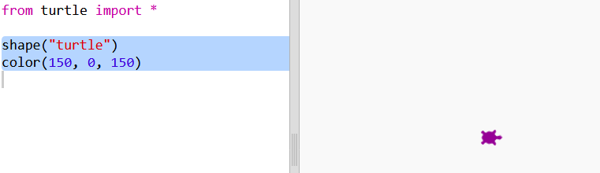
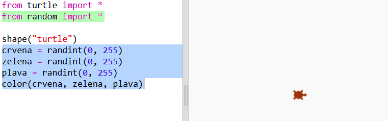
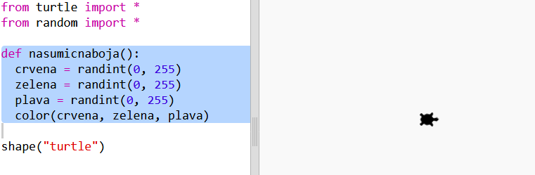
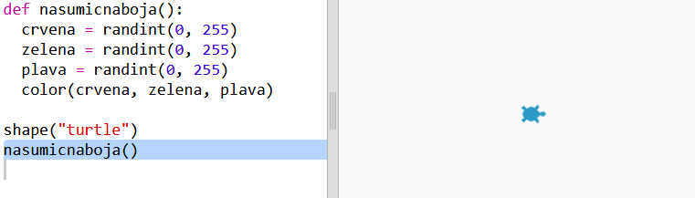

## Nasumične boje

+ Otvori sljedeći trinket: <a href="http://jumpto.cc/modern-go" target="_blank">jumpto.cc/modern-go</a>.

+ Možeš da podesiš boju kornjače tako što ćeš odrediti koliko želiš crvene, zelene i plave boje od 0 do 255.
    
    Dodaj sljedeći kôd da tvoja kornjača bude ljubičasta:
    
    
    
    Ljubičasta se dobije kada se pomiješaju crvena i plava boja.

+ Isprobaj različite brojeve kako bi dobio/dobila različite boje.
    
    Zapamti da svaki broj može da bude od 0 do 255.

+ Kako bi bilo da nasumično odaberemo boju?
    
    Izmijeni svoj kôd tako da bira nasumičan broj od 0 do 255 za vrijednosti crvene, zelene i plave boje:
    
    

+ Klikni na 'Run' nekoliko puta da dobiješ kornjače različitih boja.

+ Zabavno je, ali ima puno toga da se pamti i piše svaki put kada želiš da se boja kornjače nasumično odredi, a i nije lako za čitanje.
    
    U Pythonu možemo da upišemo `def` za definisanje funkcije koju možemo da pozovemo svaki put kada treba nasumično odabrati boju kornjače.
    
    Već smo pozivali funkcije; `color()` i `randint()` su funkcije koje su unaprijed definisane za tebe.
    
    Stavimo kôd za nasumičnu boju u funkciju koristeći def:
    
    
    
    Ne zaboravi da uvučeš kôd unutar funkcije. Funkcije se obično nalaze na početku skripte, poslije naredbi import.

+ Ako sada klikneš na 'Run', nećeš dobiti nasumično obojenu kornjaču. To je zato što smo definisali funkciju, ali je još nismo pozvali.

+ Dodaj red za pozivanje nove funkcije:
    
    
    
    Primijetićeš da je tvoj novi kôd puno lakše razumjeti zato što je komplikovani dio u funkciji. Lako je shvatiti šta funkcija `nasumicnaboja()` radi.