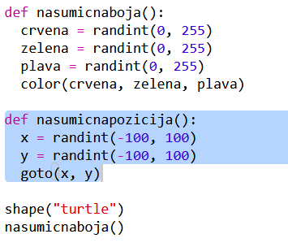
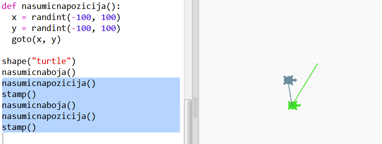
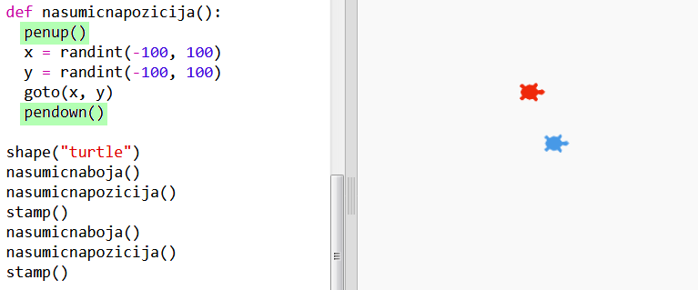

## Nasumična pozicija

Kreirajmo još jednu funkciju za pomjeranje kornjače na nasumično mjesto na ekranu. Centar ekrana je (0,0), pa ćemo kornjače smjestiti oko centra, u prostor u obliku kvadrata.

+ Dodaj funkciju `nasumicnapozicija()`:
    
    

+ Isprobaj svoju novu funkciju tako što ćeš prvo pozvati nju, a zatim funkciju `stamp()`. Možeš je pozvati više puta:
    
    

+ Ups, kornjača crta dok se kreće. Podignimo olovku na početku i spustimo je na kraju, tako da kornjača ne crta dok se kreće:
    
    
    
    Primjećuješ li da je trebalo da 'popraviš' kôd samo na jednom mjestu? To je još jedna prednost funkcija.

+ Sada isprobaj svoj kôd nekoliko puta.