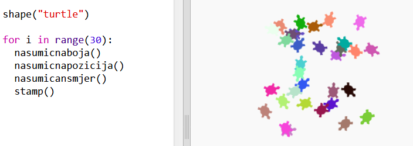

\--- challenge \---

## Izazov: Kornjačina umjetnost

Možeš li da definišeš funkciju `nasumicansmjer()` koja će okretati kornjaču u nasumičnom smjeru i napraviš da sljedeći kôd funkcioniše?

Pomoć:

- `setheading(<number>)` će promijeniti smjer u kojem je kornjača okrenuta.

- `<number>` treba da bude između 1 i 360 (broj stepeni u krugu).

- Možeš da koristiš `randint(1, 360)` za biranje broja između 1 i 360.

\--- /challenge \---