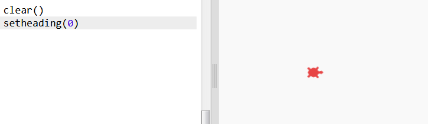
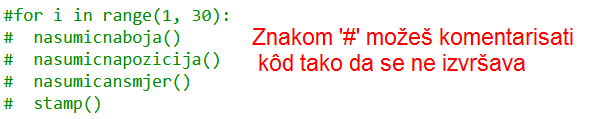
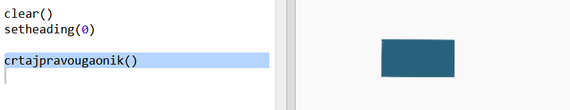
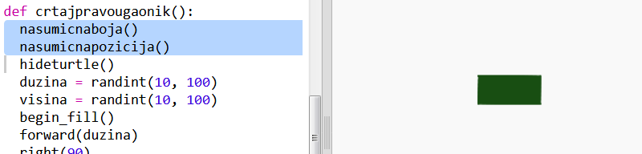
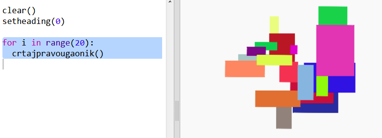

## Kreiraj modernu umjetnost sa pravougaonicima

Kreirajmo sada modernu umjetnost crtajući puno pravougaonika različitih veličina i boja.

+ Prvo dodaj sljedeći kôd na kraju svoje skripte, poslije kôda koji si napisao/napisala rješavajući izazov. Tako ćeš očistiti ekran nakon kornjačine umjetnosti i usmjeriti kornjaču u njenom uobičajenom smjeru:
    
    

+ Možeš da komentarišeš kôd za kornjačinu umjetnost unoseći `#` na početak svakog reda, tako da se kôd ne izvršava dok budeš radio/radila na umjetnosti sa pravougaonicima. (Kasnije možeš da ukloniš komentar kako bi bilo prikazano sve što si napravio/napravila.)
    
    

+ Dodajmo sada funkciju za crtanje pravougaonika nasumične veličine i boje na nasumičnom mjestu!
    
    Dodaj funkciju `crtajpravougaonik()` poslije ostalih svojih funkcija:
    
    
    
    Potraži u `snippets.py` pomoćni kôd ako želiš da uštediš vrijeme na upisivanju.

+ Na kraju `main.py` dodaj sljedeći kôd za pozivanje svoje nove funkcije:
    
    
    
    Pokreni svoju skriptu nekoliko puta da vidiš kako se mijenjaju visina i širina.

+ Pravougaonik je uvijek iste boje i nalazi se na istom mjestu.
    
    Sada treba da obojiš kornjaču nasumičnom bojom, a zatim da je pomjeriš na nasumično mjesto. Hej, zar nisi već kreirao/kreirala funkcije koje to rade? Odlično. Možeš jednostavno da ih pozoveš na početku funkcije crtajpravougaonik:
    
    
    
    Izvrsno! Bilo je mnogo manje posla, a i puno je jednostavnije za čitanje.

+ Sada pozovimo funkciju `crtajpravougaonik()` unutar petlje kako bismo kreirali sjajnu modernu umjetnost:
    
    

+ Uh, ovo je bilo malo sporo, zar ne! Srećom, možeš da ubrzaš kornjaču.
    
    Pronađi red u kojem je oblik postavljen na 'turtle' (kornjaču) i dodaj označeni kôd:
    
    
    
    `speed(0)` je najbrže, ali možeš koristiti i brojeve od 1(sporo) do 10 (brzo). Isprobavaj dok ne nađeš brzinu koja ti odgovara.