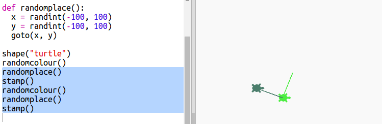

## कोणतेही स्थान

स्क्रीनवर turtle ला यादृच्छिक ठिकाणी हलवण्यासाठी आणखी एक फंक्शन तयार करू. स्क्रीनचे मध्यभागी (0,0) आहे म्हणून आम्ही मध्यभागी चौरस क्षेत्रात कासव ठेवू.

+ `randomplace()` फुंकशन जोडा:
    
    

+ आपले नवीन कार्य कॉल करून आणि नंतर `stamp()` वर कॉल करून पहा, आपण त्यास एकापेक्षा जास्त वेळा कॉल करू शकता:
    
    

+ अरेरे, turtle काढतो जेव्हा तो हलतो. चला सुरुवातीला आणि शेवटी पेन वर ठेवू जेणेकरून कासव हालचाल करत असताना काढू नये:
    
    
    
    आपणास असे लक्षात आले आहे की आपल्याला फक्त एकाच ठिकाणी कोड 'निराकरण(fix)' करावा लागला आहे? ही फंक्शन्स बद्दल आणखी एक चांगली गोष्ट आहे.

+ आता आपल्या कोडची काही वेळा चाचणी घ्या.