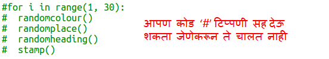

## आयत आधुनिक कला तयार करा

आता वेगवेगळ्या आकारांचे आणि रंगांचे बरेच आयत रेखांकित करून काही आधुनिक कला तयार करूया.

+ आपल्या turtle आर्टनंतर स्क्रीन साफ करण्यासाठी आणि turtle ला नेहमीच्या दिशेने निर्देशित करण्यासाठी प्रथम, आपल्या चॅलेंज कोड नंतर, आपल्या स्क्रिप्टच्या तळाशी खालील कोड जोडा:
    
    

+ आपण आपल्या टर्टल आर्ट कोडवर प्रत्येक ओळीच्या सुरूवातीस `#` ठेवून टिप्पणी देऊ शकता जेणेकरून आपण आयत कलेवर काम करत असताना चालणार नाही. (नंतर आपण आपले सर्व कार्य दर्शविण्यासाठी नंतर हे बेरबडी करू शकता.)
    
    

+ आता यादृच्छिक स्थानावर यादृच्छिक-आकाराचे, यादृच्छिक-रंगाचे आयत काढण्यासाठी फंक्शन जोडा!
    
    आपल्या इतर फुंकशन नंतर `drawrectangle()` फुंकशन जोडा:
    
    
    
    आपल्याला काही टायपिंगचा वेळ वाचवायचा असल्यास काही सहाय्यक कोडसाठी `snippets.py` पहा.

+ आपल्या नवीन कार्यास कॉल करण्यासाठी `main.py` तळाशी खालील कोड जोडा:
    
    
    
    उंची आणि रुंदी बदल पाहण्यासाठी आपली स्क्रिप्ट काही वेळा चालवा.

+ आयत नेहमी सारखाच असतो आणि त्याच ठिकाणी सुरू होतो.
    
    आता आपल्याला कासव यादृच्छिक रंगात सेट करणे आणि नंतर त्यास यादृच्छिक ठिकाणी हलविणे आवश्यक आहे. अहो, असे करण्यासाठी आपण आधीपासूनच फुंकशन तयार केली नाहीत? अप्रतिम. आपण त्यांना रेखाचित्र कार्याच्या सुरूवातीपासूनच कॉल करू शकता:
    
    
    
    व्वा हे खूपच कमी काम होते आणि हे वाचणे खूप सोपे आहे.

+ आता मस्त आधुनिक कला तयार करण्यासाठी लूपमध्ये `drawrectangle()` वर कॉल करूया:
    
    

+ जरा जरा धीमे होतो तो नव्हता! सुदैवाने आपण कासव वेग वाढवू शकता.
    
    आपण 'turtle' वर आकार सेट केला तेथे ओळ शोधा आणि हायलाइट केलेला कोड जोडा:
    
    
    
    `speed(0)` सर्वात वेगवान आहे किंवा आपल्याला 1 (स्लो) ते 10 (जलद.) पर्यंतचा क्रमांक जोपर्यंत आपल्या आवडीचा वेग सापडत नाही तोपर्यंत आपण प्रयोग वापरू शकता.