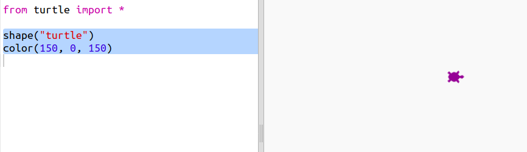
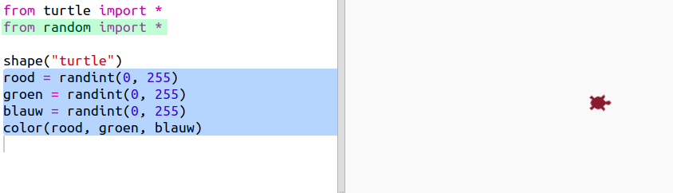
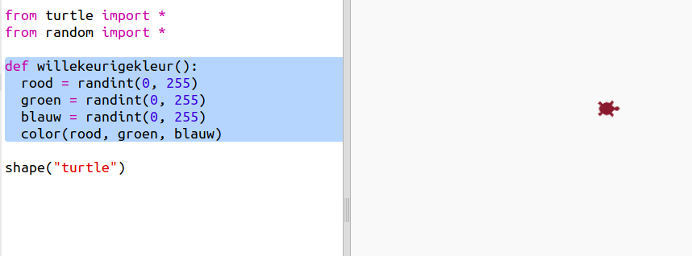
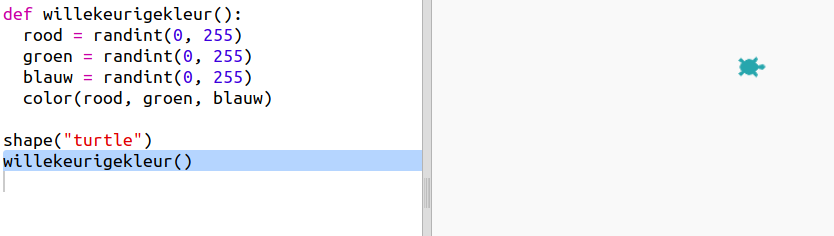

## Willekeurige kleuren

+ Open deze trinket: <a href="https://trinket.io/python/8ce1ed5d67
" target="_blank">trinket.io/python/153a641a44
</a>.

+ Je kunt de kleur van een schildpad (Engels: turtle) instellen door te zeggen hoeveel rood, groen en blauw je wilt van 0 tot 255.
    
    Voeg de volgende code toe om een ​​paarse schildpad te krijgen:
    
    
    
    Paars wordt gemaakt door rood en blauw te mengen.

+ Probeer wat verschillende getallen om verschillende kleuren te krijgen.
    
    Denk eraan dat het elk getal tussen 0 en 255 kan zijn.

+ Hoe kun je een willekeurige kleur kiezen?
    
    Werk de code bij om een ​​willekeurig getal tussen 0 en 255 te kiezen voor de rode, groene en blauwe waarden:
    
    

+ Klik een paar keer op 'Run' om verschillende gekleurde schildpadden te krijgen.

+ Erg leuk, maar om dat voor elke keer dat je een schildpad in een willekeurige kleur wilt plaatsen te onthouden en te typen is nogal wat en het is ook niet erg leesbaar.
    
    In Python kunnen we `def` gebruiken om een functie te definiëren die we kunnen oproepen als we de schildpad een willekeurige kleur willen geven.
    
    Je hebt al functies opgeroepen, `color()` en `randint()` zijn functies die al voor je zijn gedefinieerd.
    
    Laten we de willekeurige kleurcode in een functie te zetten met def:
    
    
    
    Zorg ervoor dat de coderegels binnen de functie inspringen. Functies worden meestal bovenaan in het script gezet, na de importregels.

+ Als je nu met 'Run' de code uitvoert krijg je geen willekeurig gekleurde schildpad. Dat komt omdat je de functie wel hebt gedefinieerd, maar nog niet hebt aangeroepen.

+ Voeg een regel toe om je nieuwe functie aan te roepen:
    
    
    
    Het valt op dat je nieuwe code veel gemakkelijker te begrijpen is omdat het ingewikkelde deel in de functie zit. Het is eenvoudig om uit te zoeken wat `willekeurigekleur()` doet.