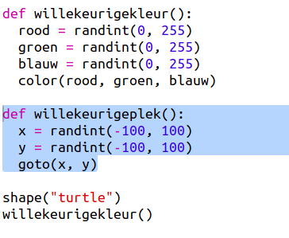
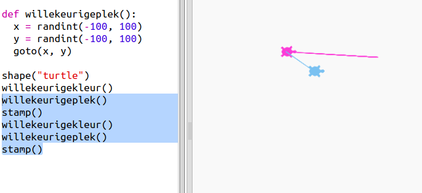
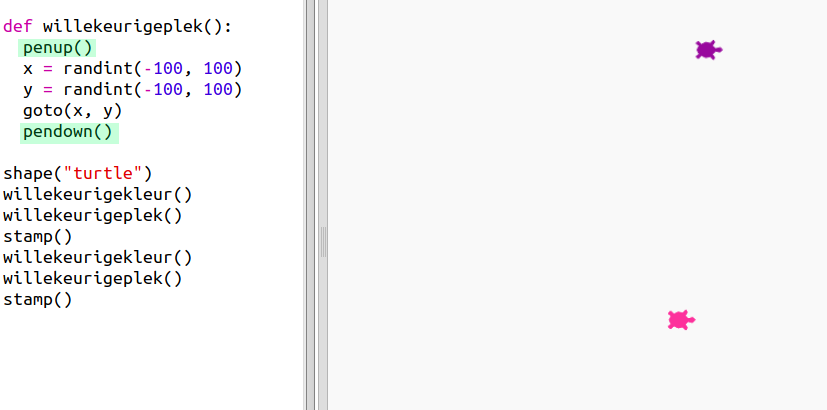

## Willekeurige plaats

Laten we nog een functie maken om de schildpad naar een willekeurige plaats op het scherm te krijgen. Het midden van het scherm is (0,0) dus plaatsen we schildpadden in een vierkant gebied rond het midden.

+ Voeg een functie `willekeurigeplaats()` toe:
    
    

+ Probeer de nieuwe functie uit door hem aan te roepen en dan `stamp()` aan te roepen, meer dan één keer:
    
    

+ Oeps, de schildpad tekent als hij beweegt. Laten we de pen aan het begin en aan het einde omhoog zetten zodat de schildpad niet tekent als die beweegt:
    
    
    
    Is het je opgevallen dat je de code maar op één plek moest 'repareren'? Dat is een ander voordeel van functies.

+ Test nu je code een paar keer.