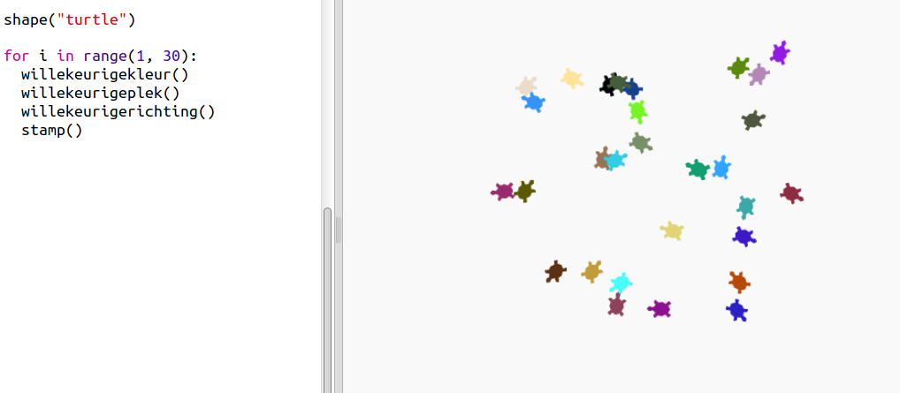

\--- challenge \---

## Uitdaging: schildpaddenkunst

Kun je een functie ` willekeurigerichting()` definiëren die de schildpad in een willekeurige richting laat wijzen en zodoende de volgende code kan laten werken?

Hints:

- `setheading([getal])` verandert de richting van de schildpad.

- [getal] moet tussen 1 en 360 zijn (het aantal graden in een cirkel)

- Je kunt `randint(1,360)` gebruiken om een ​​nummer tussen 1 en 360 te kiezen.

\--- /challenge \---