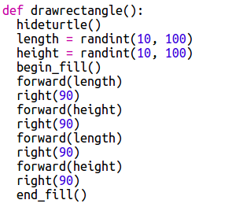

## Maak rechthoekige moderne kunst

Laten we nu wat moderne kunst maken door veel rechthoeken met verschillende afmetingen en kleuren te tekenen.

+ Voeg eerst de volgende code toe aan de onderkant van het script, na de uitdagings-code, om het scherm te wissen na de schildpadkunst en de schildpad weer in de gebruikelijke richting te laten wijzen:
    
    

+ Je kunt van de schilpad- (Engels: turtle) kunstcode commentaarregels maken door een `#` te zetten aan het begin van elke regel zodat die niet wordt uitgevoerd als je bezig bent met de rechthoekenkunst. (Die kun je later weer weghalen om alles weer te laten zien)
    
    

+ Laten we nu een functie toevoegen om een rechthoek te tekenen met een willekeurig f​​ormaat, willekeurig gekleurd en op een willekeurige plek!
    
    Voeg een functie ` tekenrechthoek() ` toe na de andere functies:
    
    
    
    Kijk in ` snippets.py ` voor hulpcode als je wat tijd wilt besparen.

+ Voeg de volgende code onderaan ` main.py ` toe om de nieuwe functie aan te roepen:
    
    
    
    Voer het script een paar keer uit om te zien hoe hoogte en breedte veranderen.

+ De rechthoek heeft altijd dezelfde kleur en begint op dezelfde plek.
    
    Nu moet je de schildpad een willekeurige kleur geven en hem dan naar een willekeurige plaats verplaatsen. Hé, had je niet al functies gemaakt om dat te doen? Geweldig. Je kunt ze gewoon aanroepen aan het begin van de functie tekenrechthoek:
    
    
    
    Wauw, dat was een stuk minder werk, en het is veel gemakkelijker om te lezen.

+ We gaan nu `tekenrechthoek()` in een lus aanroepen om wat moderne kunst te maken:
    
    

+ Goh dat was een beetje traag, nietwaar? Gelukkig kun je de schildpad versnellen.
    
    Zoek de regel waar je de vorm (Engels: shape) hebt ingesteld op 'turtle' en voeg de gemarkeerde code toe:
    
    
    
    `speed(0)` is het snelste, maar je kunt getallen gebruiken van 1 (langzaam) tot 10 (snel). Probeer wat uit tot je een goede snelheid hebt gevonden.