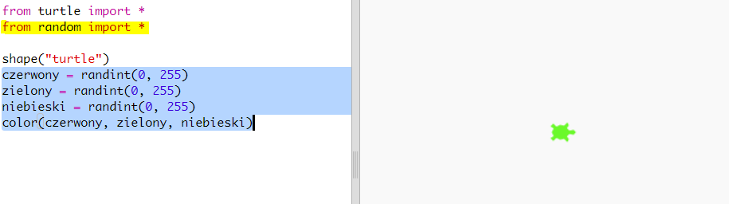
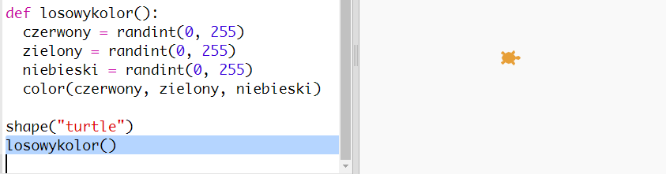

## Losowe kolory

+ Otwórz ten szablon: <a href="http://jumpto.cc/modern-go" target="_blank">jumpto.cc/modern-go</a>.

+ Możesz ustawić kolor żółwia mówiąc, ile chcesz czerwonego, zielonego i niebieskiego od 0 do 255.
    
    Dodaj następujący kod, aby uzyskać fioletowego żółwia:
    
    
    
    Fioletowy powstaje przez zmieszanie czerwonego i niebieskiego.

\--- collapse \---

* * *

## tytuł: „Błąd - niewłaściwa sekwencja kolorów: (150, 0, 150)”

Czy pojawia się błąd `niewłaściwa sekwencja kolorów: (150, 0, 150)` podczas uruchamiania kodu.

Jest tak, ponieważ edytor trinket używa innego trybu kolorów niż inne edytory Python. Można to naprawić, zmieniając `colormode` na `255`.

```python
from turtle import *

colormode(255)

shape("turtle")
color(150,0,150)
```

\--- /collapse \---

+ Wypróbuj różne liczby, aby uzyskać różne kolory.
    
    Pamiętaj, że każda liczba może być od 0 do 255.

+ Co powiesz na wybór losowego koloru?
    
    Popraw kod, aby wybrać losową liczbę od 0 do 255 dla czerwonego, zielonego i niebieskiego:
    
    

+ Kliknij kilka razy „Run”, aby uzyskać żółwie w różnych kolorach.

+ To fajne, ale dużo trzeba pamiętać i pisać za każdym razem, gdy chcesz ustawić żółwia na losowy kolor i nie jest to łatwe do odczytania.
    
    W Pythonie możemy napisać `def` aby zdefiniować funkcję, którą możemy wywołać za każdym razem, gdy musimy ustawić żółwia na losowy kolor.
    
    Wywoływałeś już wcześniej funkcje, `color()` i `randint()` to funkcje, które zostały zdefiniowane dla Ciebie.
    
    Umieśćmy losowy kod koloru w funkcji za pomocą def:
    
    
    
    Upewnij się, że wpisałeś ten kod wewnątrz funkcji. Funkcje są zwykle umieszczane u góry skryptu po imporcie.

+ Jeśli teraz uruchomisz swój kod wciskając "Run", nie otrzymasz żółwia o losowych kolorach. To dlatego, że zdefiniowałeś swoją funkcję, ale jeszcze jej nie wywołałeś.

+ Dodaj linię, aby wywołać nową funkcję:
    
    
    
    Zauważ, że twój nowy kod jest znacznie łatwiejszy do zrozumienia, ponieważ jego skomplikowana część jest w funkcji. Łatwo jest ustalić, co robi `randomcolour()`.