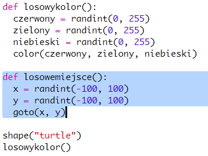
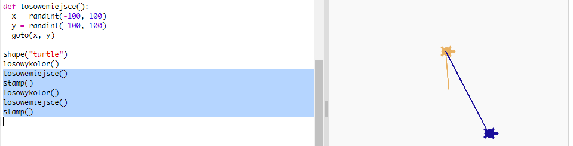
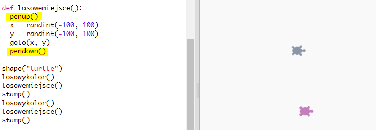

## Losowe miejsce

Stwórzmy kolejną funkcję, aby przenieść żółwia do losowego miejsca na ekranie. Środek ekranu wynosi (0,0), więc umieszczamy żółwie w kwadratowym obszarze wokół środka.

+ Dodaj funkcję `randomplace ()`:
    
    

+ Wypróbuj nową funkcję, wywołując ją, a następnie wywołując `pieczęć ()`, możesz zadzwonić do niej więcej niż jeden raz:
    
    

+ Ooops, żółw rysuje, gdy się porusza. Odłóżmy pióro na początku i na końcu, aby żółw nie rysował podczas ruchu:
    
    
    
    Czy zauważyłeś, że wystarczy "naprawić" kod w jednym miejscu? To kolejna dobra rzecz w funkcjonowaniu.

+ Teraz przetestuj swój kod kilka razy.