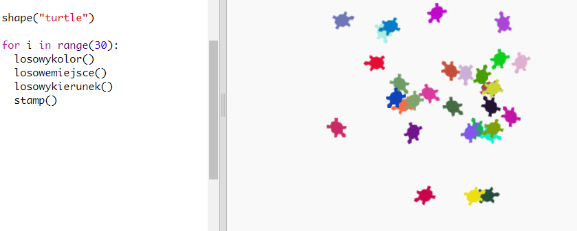

\--- challenge \---

## Wyzwanie: Sztuka żółwia

Czy potrafisz zdefiniować funkcję `losowykierunek()`, która spowoduje, że żółw wybierze losowy kierunek i sprawi, że poniższy kod zadziała?

Wskazówka:

- `setheading(<number>)` zmieni kierunek, w jaki żółw jest skierowany.

- `<number>` powinien zawierać się między 1 a 360 (liczba stopni w kole)

- Możesz użyć `randint(1, 360)`, aby wybrać liczbę od 1 do 360.

\--- /challenge \---