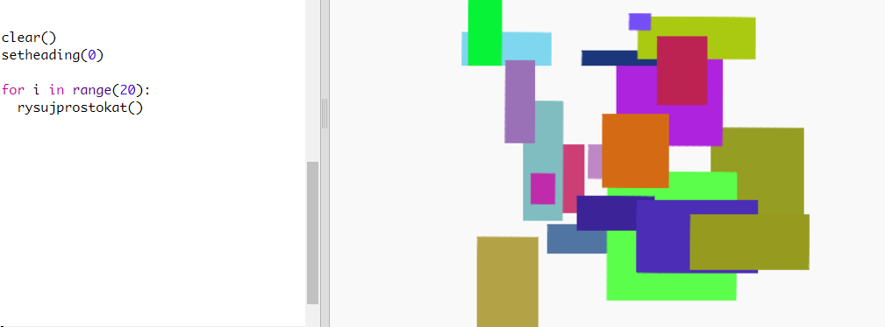

## Stwórz prostokąt sztuki nowoczesnej

Teraz stwórzmy sztukę nowoczesną, rysując wiele prostokątów o różnych rozmiarach i kolorach.

+ Najpierw dodaj poniższy kod na końcu skryptu, po kodzie twojego wyzwania, aby wyczyścić ekran po twojej żółwiowej sztuce i skierować żółwia w zwykłym kierunku:
    
    

+ Możesz zakomentować (wyłączyć) swój kod sztuki żółwia, umieszczając `#` na początku każdego wiersza, aby nie działał podczas pracy nad prostokątem. (Potem możesz to odkomentować, aby pochwalić się całą swoją pracą.)
    
    

+ Teraz dodajmy funkcję rysowania prostokąta o losowej wielkości i losowym kolorze w losowym miejscu!
    
    Dodaj funkcję `rysujprostokat()` po innych funkcjach:
    
    
    
    Zajrzyj do `snippets.py` , aby uzyskać kod pomocnika, jeśli chcesz zaoszczędzić trochę czasu na pisanie.

+ Dodaj następujący kod u dołu `main.py` , aby wywołać nową funkcję:
    
    
    
    Uruchom skrypt kilka razy, aby zobaczyć zmianę wysokości i szerokości.

+ Prostokąt ma zawsze ten sam kolor i zaczyna się w tym samym miejscu.
    
    Teraz musisz ustawić żółwia na losowy kolor, a następnie przenieść go do losowego miejsca. Hej, czy nie stworzyłeś już funkcji, by to zrobić? Niesamowite. Możesz po prostu wywołać je od początku funkcji rysujprostokat:
    
    
    
    Wow, to było o wiele mniej pracy i jest o wiele łatwiejsze do odczytania.

+ Teraz wywołajmy `rysujprostokat()` w pętli, aby stworzyć fajną sztukę nowoczesną:
    
    

+ Rany, to było trochę powolne, prawda? Na szczęście możesz przyspieszyć żółwia.
    
    Znajdź linię, w której ustawisz kształt na "turtle" i dodaj wyróżniony kod:
    
    
    
    `speed(0)` jest najszybsza lub możesz użyć liczb od 1 (wolny) do 10 (szybki). Eksperymentuj dopóki nie znajdziesz prędkości, która ci się spodoba.