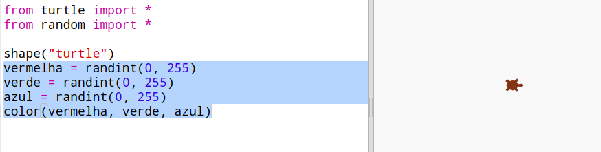
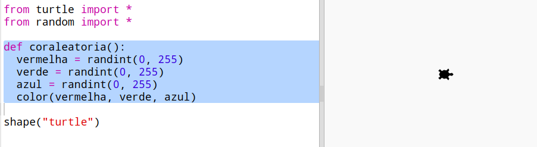
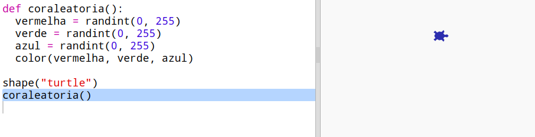

## Cores aleatórias

+ Abra este trinket: <a href="https://trinket.io/python/3a98dc09b2" target="_blank">jumpto.cc/modern-go</a>.

+ Você pode definir a cor de uma tartaruga dizendo quanto de vermelho, verde e azul você gostaria de 0 a 255.
    
    Adicione o seguinte código para obter uma tartaruga roxa:
    
    
    
    O roxo é feito misturando vermelho e azul.

--- collapse ---
---
title: "Error - bad color sequence: (150, 0, 150)"
---

Você recebe o erro `bad color sequence: (150, 0, 150)` ao executar o seu código?

Isso ocorre porque o Trinket usa um modo de cor diferente de outros editores Python. Pode ser corrigido alterando o `colormode` para `255`.

```python
from turtle import *

colormode(255)

shape("turtle")
color(150,0,150)
```

--- /collapse ---

+ Tente alguns números diferentes para obter cores diferentes.
    
    Lembre-se de que cada número pode ser de 0 a 255.

+ Que tal escolher uma cor aleatória?
    
    Atualize seu código para escolher um número aleatório entre 0 e 255, para os valores de vermelha, verde e azul:
    
    

+ Clique em "Run" algumas vezes para obter tartarugas de cores diferentes.

+ Isso é divertido, mas é muita coisa para lembrar e digitar toda vez que você deseja definir uma cor aleatória para uma tartaruga e não é muito fácil para ler.
    
    Em Python, podemos escrever `def` para definir uma função que podemos chamar sempre que precisarmos definir uma cor aleatória para a tartaruga.
    
    Você já está chamando funções, `color()` e `randint()` são funções que foram definidas para você.
    
    Vamos colocar o código de cor aleatória dentro de uma função usando def:
    
    
    
    Certifique-se de indentar o código dentro da função. Geralmente as funções são colocadas no topo do script, após as importações.

+ Se você clicar em "Run" para executar seu código, agora você não terá uma tartaruga de cor aleatória. Isso é porque você definiu sua função, mas ainda não a chamou.

+ Adicione uma linha para chamar sua nova função:
    
    
    
    Observe que seu novo código é muito mais fácil de entender porque a parte complexa está na função. É fácil descobrir o que `coraleatoria()` faz.