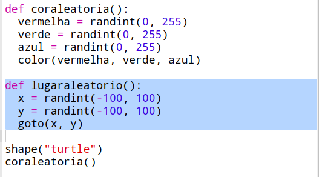
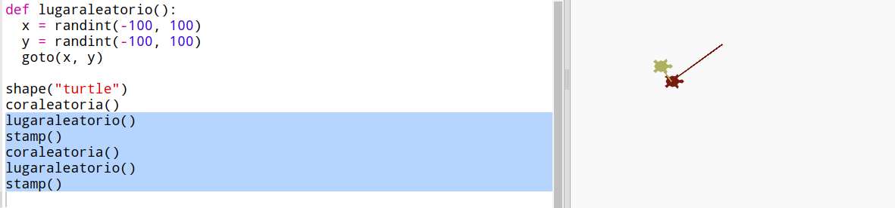
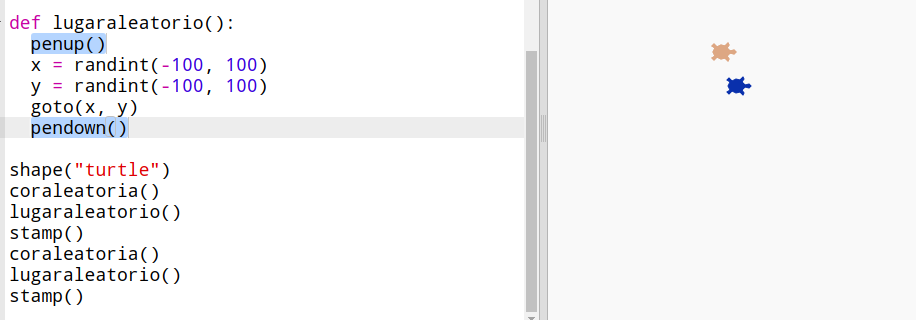

## Lugar aleatório

Vamos criar outra função para mover a tartaruga para um lugar aleatório na tela. O centro da tela é (0,0) então vamos colocar tartarugas em uma área quadrada em torno do centro.

+ Inclua uma função `lugaraleatorio()`:
    
    

+ Experimente sua nova função chamando-a e, em seguida, chamando `stamp()`, você pode acioná-la mais de uma vez:
    
    

+ Opa, a tartaruga desenha enquanto se move. Vamos levantar a caneta no começo e colocá-la no final para que a tartaruga não desenhe enquanto está se movendo:
    
    
    
    Você percebeu que só teve que "consertar" o código em um único lugar? Esta é outra coisa boa das funções.

+ Agora teste seu código algumas vezes.