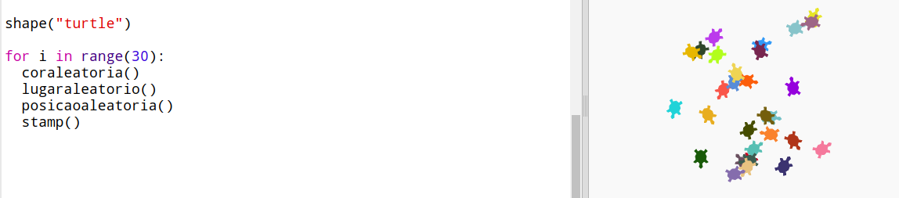

--- challenge ---

## Desafio: arte da tartaruga

Você pode definir uma função `posicaoaleatoria()` que faça com que a tartaruga aponte em uma direção aleatória e fazer o seguinte código funcionar?

Dicas:

- `setheading(<number>)` mudará a direção em que a tartaruga está voltada.

- `<number>` deve estar entre 1 e 360 ​​(o número de graus em um círculo)

- Você pode usar `randint(1, 360)` para escolher um número entre 1 e 360.

--- /challenge ---