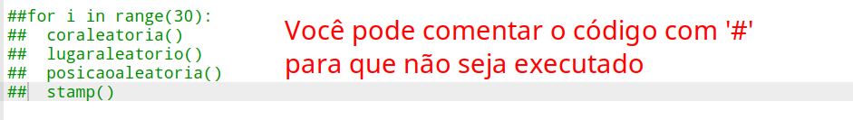
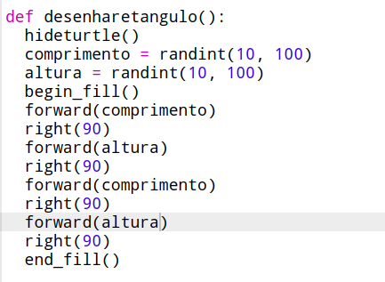
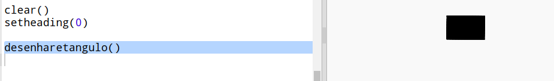
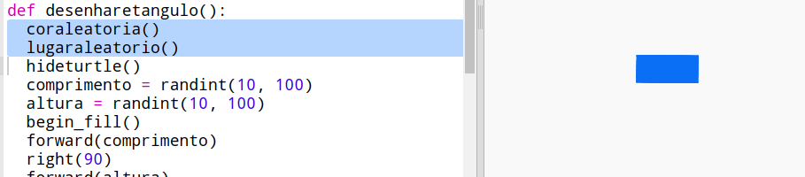

## Criar arte moderna retangular

Agora vamos criar algumas artes modernas desenhando muitos retângulos de diferentes tamanhos e cores.

+ Primeiro, adicione o seguinte código na parte inferior do seu script, após o código do desafio, para limpar a tela após a arte da sua tartaruga e apontar a tartaruga na direção usual:
    
    

+ Você pode comentar seu código de arte de tartaruga colocando `#` no início de cada linha para que ele não seja executado enquanto você estiver trabalhando na arte do retângulo. (Então você pode remover o comentário mais tarde para mostrar todo o seu trabalho.)
    
    

+ Agora vamos adicionar uma função para desenhar um retângulo de tamanho aleatório, de cor aleatória e em um lugar aleatório!
    
    Adicione uma função `desenharetangulo()` após suas outras funções:
    
    
    
    Procure em `snippets.py` por algum código auxiliar se você quiser economizar algum tempo de digitação.

+ Adicione o seguinte código na parte inferior de `main.py` para chamar sua nova função:
    
    
    
    Clique em "Run" para executar seu script algumas vezes e veja a altura e largura mudar.

+ O retângulo é sempre da mesma cor e começa no mesmo local.
    
    Agora você precisa definir para a tartaruga uma cor aleatória e depois mover ela para um local aleatório. Ei, você não criou funções para fazer isso? Fantástico! Basta chamá-las no início da função desenharetangulo:
    
    
    
    Uau, isso foi muito menos trabalho e é muito mais fácil de ler.

+ Agora vamos chamar `desenharetangulo()` em um laço para criar uma arte moderna legal:
    
    

+ Poxa, isso foi um pouco lento! Felizmente você pode acelerar a tartaruga.
    
    Encontre a linha em que você definiu a forma para a "tartaruga" e adicione o código realçado:
    
    
    
    `speed(0)` é o mais rápido ou você pode usar números de 1 (lento) a 10 (rápido). Experimente até encontrar uma velocidade que você goste.