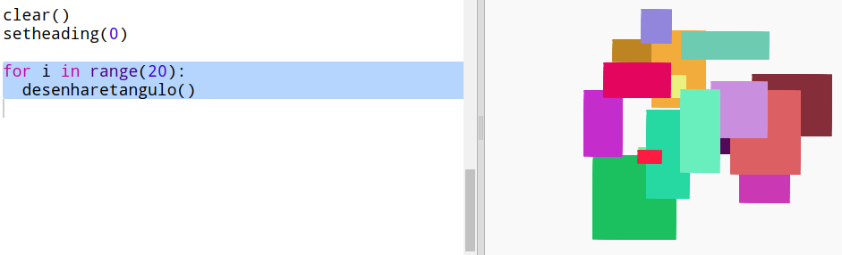

## Criar arte moderna retangular

Agora vamos criar algumas artes modernas desenhando muitos retângulos de diferentes tamanhos e cores.

+ Primeiro adicione o código a seguir ao final do seu script, após o seu código de desafio, para limpar a tela após a arte da tartaruga e aponte a tartaruga na direção usual:
    
    

+ Você pode comentar seu código de arte de tartaruga colocando `#` no início de cada linha para que ele não seja executado enquanto você estiver trabalhando na arte do retângulo. (Então você pode descomentar mais tarde para mostrar todo o seu trabalho.)
    
    

+ Agora vamos adicionar uma função para desenhar um retângulo aleatório de tamanho aleatório em um local aleatório!
    
    Adicione uma função `drawrectangle ()` após suas outras funções:
    
    
    
    Procure em `snippets.py` por algum código auxiliar, se você quiser economizar algum tempo de digitação.

+ Adicione o seguinte código na parte inferior de `main.py` para chamar sua nova função:
    
    
    
    Execute seu script algumas vezes para ver a altura e a largura.

+ O retângulo é sempre da mesma cor e começa no mesmo local.
    
    Agora você precisa definir a tartaruga para uma cor aleatória e mova-a para um local aleatório. Ei, você não criou funções para fazer isso? Impressionante. Você pode apenas chamá-los desde o início da função drawrectangle:
    
    
    
    Uau, isso foi muito menos trabalho, e é muito mais fácil de ler.

+ Agora vamos chamar `drawrectangle ()` em um loop para criar uma arte moderna legal:
    
    

+ Puxa que foi um pouco lento não foi! Felizmente você pode acelerar a tartaruga.
    
    Encontre a linha em que você definiu a forma como "turtle" e adicione o código realçado:
    
    
    
    `velocidade (0)` é o mais rápido ou você pode usar números de 1 (lento) a 10 (rápido). Experimente até encontrar uma velocidade que você gosta.