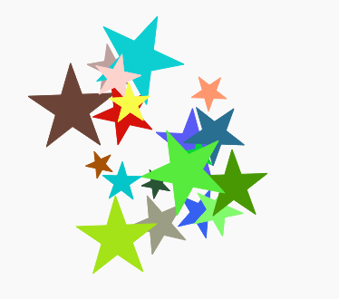

\--- desafio \---

## Desafio: Mais arte moderna

Você pode criar uma função que desenhe uma forma e chame suas funções `coraleatoria ()` e / ou `lugaraleatorio ()`?

Você pode chamar sua função de dentro de um loop `para` como você fez na arte do retângulo para gerar arte moderna.

Idéias:

- Tartarugas têm uma função chamada ponto que leva um raio (distância do centro até a borda do círculo) como entrada. Ex.: turtle.dot (10) Você pode criar uma função `desenhacirculo () ` que desenha um círculo com um raio aleatório.
    
    

- Procure em `snippets.py` por exemplo, código para desenhar estrelas com a tartaruga.
    
    

\--- / desafio \---