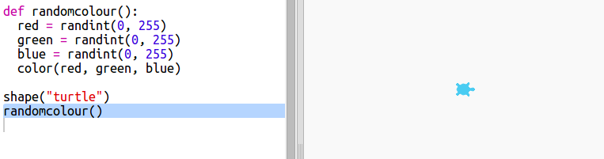

## Cores aleatórias

+ Abra este trinket: <a href="http://jumpto.cc/modern-go" target="_blank">jumpto.cc/modern-go</a>.

+ Você pode definir a cor de uma tartaruga dizendo quanto vermelho, verde e azul você gostaria de 0 a 255.
    
    Adicione o seguinte código para obter uma tartaruga roxa:
    
    
    
    O roxo é feito misturando vermelho e azul.

+ Tente alguns números diferentes para obter cores diferentes.
    
    Lembre-se de que cada número pode ser de 0 a 255.

+ Que tal escolher uma cor aleatória?
    
    Atualize seu código para escolher um número aleatório entre 0 e 255 para os valores vermelho, verde e azul:
    
    

+ Clique em "Run" algumas vezes para obter diferentes tartarugas coloridas.

+ Isso é divertido, mas é muito para lembrar e digitar toda vez que você quiser definir uma tartaruga para uma cor aleatória e não é muito fácil de ler.
    
    Em Python, podemos escrever `def` para definir uma função que podemos chamar sempre que precisarmos definir a tartaruga para uma cor aleatória.
    
    Você já está chamando funções, `color ()` e `randint ()` são funções que foram definidas para você.
    
    Vamos colocar o código de cor aleatório em uma função usando def:
    
    
    
    Certifique-se de recuar o código dentro da função. As funções geralmente são colocadas no topo do script após as importações.

+ Se você 'Run' seu código agora você não recebe uma tartaruga de cor aleatória. Isso é porque você definiu sua função, mas ainda não a chamou.

+ Adicione uma linha para chamar sua nova função:
    
    
    
    Observe que seu novo código é muito mais fácil de entender porque a parte complexa está na função. É fácil descobrir o que `randomcolour ()` faz.