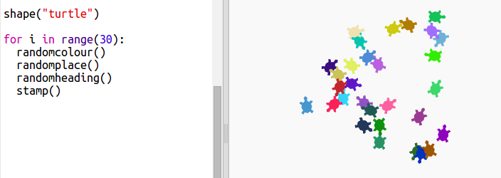

\--- challenge \---

## Desafio: Arte da tartaruga

Consegues definir uma função `direcaoAleatoria ()` que faça a tartaruga apontar para uma direção aleatória e fazer o seguinte código funcionar?

Dicas:

- `definirDirecao(<number>)` mudará a direção para onde a tartaruga está voltada.

- `<number>` deve estar entre 1 e 360 ​​(o número de graus num círculo)

- Tu podes usar `randint (1, 360)` para escolher um número entre 1 e 360.

\--- /challenge \---