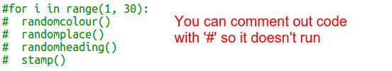

## Criar arte moderna retangular

Agora vamos criar alguma arte moderna desenhando muitos retângulos de diferentes tamanhos e cores.

+ Primeiro adiciona o código seguinte ao final do teu script, após o teu código de desafio, para limpar o ecrã após a arte da tartaruga e aponta a tartaruga na direção usual:
    
    

+ Podes comentar o teu código de arte de tartaruga colocando `#` no início de cada linha para que ele não seja executado enquanto estiveres a trabalhar na arte de retângulo. (Podes descomentar mais tarde para mostrar todo o teu trabalho.)
    
    

+ Agora vamos adicionar uma função para desenhar um retângulo aleatório de tamanho aleatório num local aleatório!
    
    Adiciona uma função `desenhaRetangulo ()` após as tuas outras funções:
    
    
    
    Procura em ` snippets.py ` por algum código auxiliar, se quiseres economizar algum tempo de digitação.

+ Adiciona o seguinte código na parte inferior de `main.py` para chamar a tua nova função:
    
    
    
    Executa o teu script algumas vezes para ver a altura e a largura mudarem.

+ O retângulo é sempre da mesma cor e começa no mesmo local.
    
    Agora precisas definir a tartaruga para uma cor aleatória e posteriormente movê-la para um local aleatório. Ei, não criaste já funções para fazer isso? Impressionante. Podes apenas chamá-las desde o início da função desenhaRetangulo:
    
    
    
    Uau, isso foi muito menos trabalho, e é muito mais fácil de ler.

+ Agora vamos chamar `desenhaRetangulo()` num ciclo para criar uma arte moderna divertida:
    
    

+ Puxa que foi um pouco lento não foi! Felizmente podes acelerar a tartaruga.
    
    Encontre a linha em que definiste a forma como "turtle" e adiciona o código realçado:
    
    
    
    `speed(0)` é o mais rápido ou tu podes usar números de 1 (lento) a 10 (rápido). Experimenta até encontrares uma velocidade que gostas.