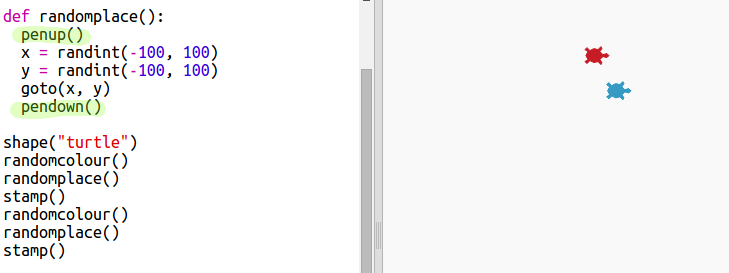

## Случайное место

Давайте создадим другую функцию, которая будет перемещать черепашку в случайное место на экране. Центру экрана соответствуют координаты (0,0), поэтому мы поместим черепашек в квадратную площадь вокруг этого центра.

+ Добавьте `randomplace()` функцию:
    
    

+ Протестируйте вашу новую функцию, вызвав её и за ней вызвав `stamp()`. Вы можете проделать это более одного раза:
    
    

+ Упс, похоже, что черепашка рисует, когда она движется. Давайте будем поднимать ручку в начале и опускать в конце, чтобы черепашка не рисовала, пока она движется:
    
    
    
    Вы заметили, что вам нужно было «исправить» код только в одном месте? Это ещё одно преимущество использования функций.

+ Теперь протестируйте ваш код несколько раз.