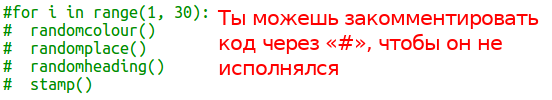
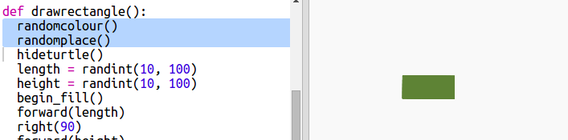

## Прямоугольное современное искусство

Теперь давайте создадим немного современного искусства, нарисовав множество прямоугольников разных размеров и цветов.

+ Для начала добавьте следующий код в конце вашего скрипта после кода задачи, чтобы очистить экран от черепашьего искусства и направить черепашку в обычном направлении:
    
    

+ Вы можете закомментировать ваш код для черепашьего искусства, поместив `#` в начало каждой строки, чтобы эти строки не исполнялись программой, пока вы работаете над прямоугольным искусством. (Позднее вы можете раскомментировать эти строки, чтобы показать всю вашу работу.)
    
    

+ Теперь давайте добавим функцию для рисования прямоугольника случайного размера, случайного цвета и в случайном месте!
    
    Добавьте функцию `drawrectangle()` после ваших других функций:
    
    
    
    Смотрите в файле `snippets.py` на вспомогательный код, если вы хотите сэкономить время.

+ Добавьте следующий код в самом низу `main.py`, чтобы вызвать вашу новую функцию:
    
    
    
    Запустите ваш скрипт несколько раз, чтобы увидеть, что высота и ширина меняются каждый раз.

+ При этом прямоугольник всегда одного цвета и его начало расположено в том же месте.
    
    Теперь вам нужно установить для черепашки случайный цвет, а затем переместить её в случайное место. Эй, а не создавали ли вы уже функции для того же самого? Отлично. Вы можете просто вызвать их в самом начале функции drawrectangle:
    
    
    
    Вот это да, нам потребовалось намного меньше работы, и код намного легче читать.

+ Теперь давайте вызовем `drawrectangle()` в цикле, чтобы создать классное современное искусство:
    
    

+ Ух, это было немного медленно, не так ли? К счастью, вы можете ускорить черепашку.
    
    Найдите строку, где вы устанавливаете значение формы как «turtle» (черепашка), и добавьте выделенный код:
    
    
    
    `speed(0)` — это максимальная скорость, но вы также можешь использовать цифры от 1 (медленно) до 10 (быстро). Поэкспериментируйте, пока не подберёте подходящую вам скорость.