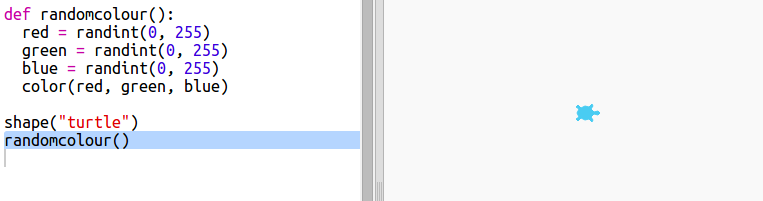

## Rastgele renkler

+ Şu trinketi açın: <a href="http://jumpto.cc/modern-go" target="_blank">jumpto.cc/modern-go</a>.

+ 0 ile 255 sayıları arasında ne kadar kırmızı, yeşil ve mavi istediğinizi söyleyerek bir kaplumbağanın rengini ayarlayabilirsiniz.
    
    Mor bir kaplumbağa elde etmek için aşağıdaki kodu ekleyin:
    
    
    
    Mor, kırmızı ve mavi karıştırılarak elde edilir.

## \--- collapse \---

## title: "Error - bad color sequence: (150, 0, 150)"

Do you get the error `bad color sequence: (150, 0, 150)` when running your code.

This is because trinket uses a different colour mode to other Python editors. It can be fixed by changing the `colormode` to `255`.

```python
from turtle import *

colormode(255)

shape("turtle")
color(150,0,150)
```

\--- /collapse \---

+ Farklı renkler elde etmek için farklı sayılar deneyin.
    
    Her sayının 0 ile 255 arasında olabileceğini unutmayın.

+ Rastgele bir renk seçmeye ne dersiniz?
    
    Kırmızı, yeşil ve mavi değerler için 0 ile 255 arasında rastgele bir sayı seçmek üzere kodunuzu güncelleyin:
    
    

+ Farklı renkte kaplumbağalar elde etmek için birkaç kez 'Run' düğmesine tıklayın.

+ Bu eğlenceli ama her seferinde bir kaplumbağayı rastgele bir renge ayarlamak istediğinizde bunları hatırlamak ve yazmak için çok iş var ve okuması da çok kolay değil.
    
    Python'da ne zaman bir kaplumbağayı rastgele bir renge ayarlamak istediğimizde `def` komutuyla bir işlev tanımlayıp bunu istediğimizde çağırabiliriz.
    
    Zaten işlevleri çağırıyordunuz, `color()` ve `randint()` işlevleri sizin için önceden tanımlanmış fonksiyonlardır.
    
    Rastgele renk kodunu def kullanarak bir fonksiyona koyalım:
    
    
    
    İşlevin içindeki kodu girintili yaptığınızdan emin olun. İşlevler, içe aktarma işleminden sonra genellikle komut dosyasının en üstüne yerleştirilir.

+ Kodunuzu şimdi 'çalıştırırsanız' rastgele renkli bir kaplumbağa elde edemezsiniz. Çünkü işlevinizi tanımladınız, ancak henüz onu çağırmadınız.

+ Yeni işlevinizi çağırmak için bir satır ekleyin:
    
    
    
    Yeni kodunuzun anlaşılması çok daha kolay olduğuna dikkat edin çünkü karmaşık kısım işlevin tanımında kaldı. `rastgelerenk()` işlevinin yaptıklarıyla çalışması daha kolay.