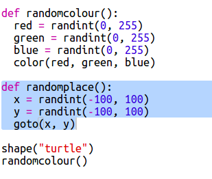

## Rastgele yerler

Kaplumbağayı ekranda rastgele bir yere taşımak için başka bir işlev oluşturalım. Ekranın merkezi (0,0) olduğundan kaplumbağaları merkezin etrafındaki kare alana yerleştireceğiz.

+ Bir `rastgeleyer()` işlevi ekleyin:
    
    

+ Yeni işlevinizi, onu ve sonrasında `stamp()` işlevini çağırarak deneyin, birden fazla kez çağırabilirsiniz:
    
    

+ Aaaaa, kaplumbağa hareket ettiğinde çizmeye başlıyor. Kalemi başlangıçta kaldıralım ve sonunda aşağı koyalım, böylece kaplumbağa hareket ederken çizgi çizemeyecek:
    
    
    
    Kodu tek bir yerde 'düzeltmeniz' gerektiğini fark ettiniz mi? Bu işlevler hakkında iyi olan başka bir özellik.

+ Şimdi kodunuzu birkaç kez test edin.