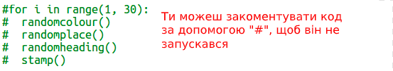

## Створити прямокутник сучасного мистецтва

Тепер давайте створимо якесь сучасне мистецтво, залучивши багато прямокутників різних розмірів та кольорів.

+ Спочатку додайте наступний код донизу вашого сценарію, після коду завдання, щоб очистити екран після твоєї мистецтва черепахи і вкажіть черепаху у звичайному напрямку:
    
    

+ Ви можете коментувати ваш код мистецтва черепаху, розмістивши `#` на початку кожного рядка, щоб він не запускався під час роботи над прямокутним мистецтвом. (Тоді ви можете пізніше розкоментувати це, щоб показати всю вашу роботу.)
    
    

+ Тепер давайте додамо функцію, щоб намалювати випадковий розмір випадкового кольору прямокутника у випадковому місці!
    
    Додайте функцію `drawrectangle ()` після інших функцій:
    
    
    
    Подивіться в `snippets.py` для деякого помічника, якщо ви хочете зберегти час набору тексту.

+ Додайте наступний код у нижній частині `main.py` , щоб викликати свою нову функцію:
    
    
    
    Запустіть свій сценарій кілька разів, щоб побачити зміни висоти та ширини.

+ Прямокутник завжди однаковий і починається з того ж місця.
    
    Тепер вам доведеться встановити черепаху до випадкового кольору, а потім перемістити його в випадкове місце. Привіт, ти вже не створив функції для цього? Чудово. Ви можете просто назвати їх з початку функції прямокутника:
    
    
    
    Вау, що було набагато менше роботи, і це набагато простіше для читання.

+ Тепер назвемо `drawrectangle ()` в циклі, щоб створити якесь класове сучасне мистецтво:
    
    

+ Гош це трохи повільно було не так! На щастя, ви можете прискорити черепаху.
    
    Знайдіть рядок, де ви встановили форму "черепаху" і додайте виділений код:
    
    
    
    `швидкість (0)` є найшвидшим або ви можете використовувати цифри від 1 (повільно) до 10 (швидко.) Експеримент, поки ви не знайдете бажану швидкість.