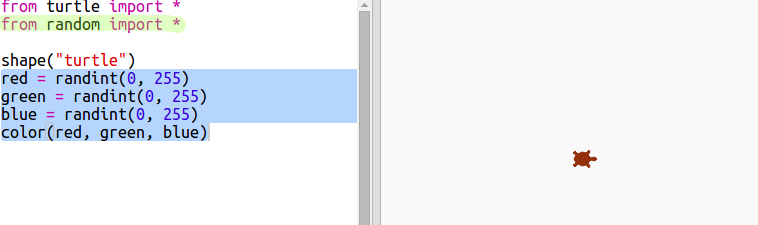

## 随机颜色

+ 打开此Trinket: <a href="http://jumpto.cc/modern-go" target="_blank"> jumpto.cc/modern-go </a>。

+ 你可以通过表明你想要的红色、绿色和蓝色色值（在 0 到 255 之间选择）来设置海龟的颜色。
    
    添加以下代码来获得一只紫色海龟：
    
    
    
    紫色是通过混合红色和蓝色而得到的。

\--- collapse \---

* * *

## title: "Error - bad color sequence: (150, 0, 150)"

当你运行代码时是否遇到`bad color sequence: (150, 0, 150)`这个错误。

这是因为Trinket使用了与其他Python编辑器不同的颜色模式。 可以通过更改`colormode`（颜色模式）至` 255 `解决这个问题 。

```python
from turtle import *

colormode(255)

shape("turtle")
color(150,0,150)
```

\--- /collapse \---

+ Try some different numbers to get different colours.
    
    Remember each number can be from 0 to 255.

+ How about choosing a random colour?
    
    Update your code to choose a random number between 0 and 255 for the red, green and blue values:
    
    

+ Click ‘Run’ a few times to get different coloured turtles.

+ That’s fun, but it’s a lot to remember and type every time you want to set a turtle to a random colour and it’s not very easy to read.
    
    In Python we can write `def` to define a function that we can call whenever we need to set the turtle to a random colour.
    
    You’ve been calling functions already, `color()` and `randint()` are functions that have been defined for you.
    
    Let’s put the random colour code into a function using def:
    
    
    
    Make sure you indent the code inside the function. Functions are usually placed at the top of the script after the imports.

+ If you ‘Run’ your code now you don’t get a random coloured turtle. That’s because you have defined your function, but not called it yet.

+ Add a line to call your new function:
    
    
    
    Notice that your new code is much easier to understand because the complex part is in the function. It’s easy to work out what `randomcolour()` does.