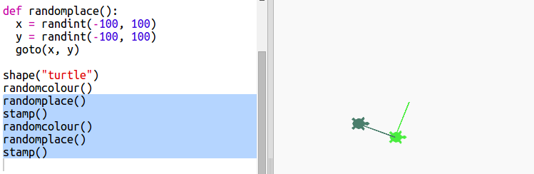

## 随机位置

Let’s create another function to move the turtle to a random place on the screen. The center of the screen is (0,0) so we’ll place turtles in a square area around the centre.

+ Add a `randomplace()` function:
    
    

+ Try your new function by calling it and then calling `stamp()`, you can call it more than once:
    
    

+ Ooops, the turtle draws when it moves. Let’s put the pen up at the beginning and down at the end so that the turtle doesn’t draw while it’s moving:
    
    
    
    Did you notice that you only had to 'fix' the code in one place? That's another good thing about functions.

+ Now test your code a few times.