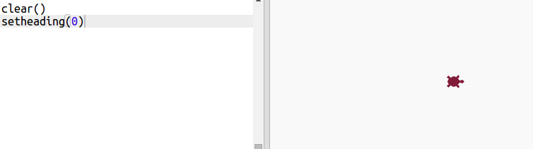
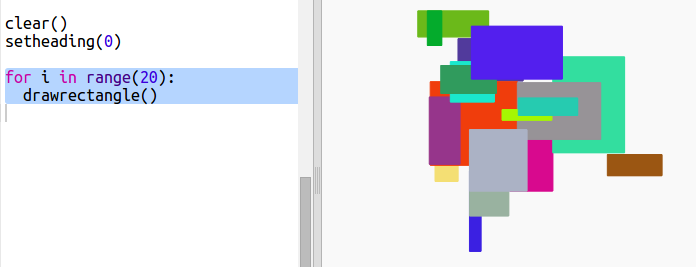

## 创建矩形现代艺术

现在让我们通过绘制大量不同尺寸和颜色的矩形来创建一些现代艺术。 

+ 首先在你脚本底部的挑战代码屏幕面添加以下代码，以在海龟艺术之后清空画，并将海龟指向其通常朝向的方向：

    

+ 你可以通过在每行开头放一个 `#` 来注释掉你的海龟艺术代码，使其无法在你创作矩形艺术时运行。（你可以随后对其取消注释，以显示你的全部工作成果。）

    
 
+ 现在让我们添加一个函数，在随机位置画一个随机大小、随机颜色的矩形！ 
    
    在你的其他函数之后添加一个 `drawrectangle()`（画矩形）函数：

    
    
    如果你想节省一些输入时间，可查看 `snippets.py` 获取一些辅助代码。 
    
+ 在 `main.py` 底部添加以下代码来调用你的新函数：

    
    
    多次运行你的脚本来查看高度和宽度的改变。 
   
+ 矩形总是具有同样的颜色，并在同一个位置启动。 

    现在你将需要将海龟设为随机颜色，然后将其移动到随机位置。嘿，你难道不是已经创建过函数来进行该操作吗？太棒了。你只需从 drawrectangle 函数的开始调用它们： 
    
    
    
    哇，这就省去了大量工作，并且更加便于读取。 

    
+ 现在让我们在循环中调用 `drawrectangle()`（画矩形）来创建一些很酷的现代艺术：

    

+ 天哪，有点太慢了，不是吗！幸运的是你可以将海龟速度加快。 

    找到你将形状设为“turtle”（海龟）的那行代码，并添加以下高亮代码：
    
    
    
    `speed(0)`（速度(0)）是最快的，或者你可以使用 1（慢）到 10（快）之间的数值。多次实验，直至你找到你喜欢的速度。 

