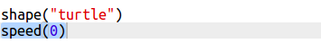

## 创建矩形现代艺术

现在让我们通过绘制大量不同大小和颜色的矩形来创建一些现代艺术。

+ 首先，在你的挑战代码后面，将以下代码添加到脚本底部，以清除绘制海龟艺术后的屏幕，并将乌龟指向其通常的方向：
    
    

+ 你可以在每一行开头用`#`注释海龟艺术的代码，这样在创作矩形艺术的时候它就不会运行了。 (之后可以取消注释来展示您所有的作品。)
    
    

+ 现在，让我们添加一个函数，以便在随机的位置绘制一个大小随机，颜色随机的矩形！
    
    在其他函数后添加一个 `drawrectangle()` 函数：
    
    
    
    如果你想节省一些输入时间，可以在`snippets.py`中寻找一些帮助代码。

+ 在`main.py`的底部添加以下代码来调用你的新函数：
    
    
    
    多次运行你的脚本，看看高度和宽度的变化。

+ 矩形总是以同一种颜色，并从同一个位置开始。
    
    现在你需要为海龟随机设置一个颜色，然后移动到随机位置。 嘿，你不是已经创建了函数来做这些吗？ 太棒了。 你只需要从drawrectangle函数开始处调用它们：
    
    
    
    哇，工作量少了很多，而且阅读起来也容易得多。

+ 现在让我们在一个循环中调用 `drawrectangle()` 来创建一些很酷的现代艺术：
    
    

+ 天哪，那不是有点慢吗！ 幸运的是，你可以加快海龟的速度。
    
    找到将形状设置为“turtle”的代码行，并添加高亮的代码：
    
    
    
    `speed(0)`是最快的，或者您可以使用1（慢）到10（快速）之间的数字进行实验，直到找到所需的速度为止。